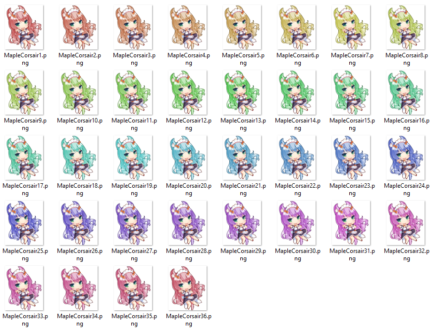

# ImageCombiner
Combines images as the name suggests.

## Usage
```sh
./ImageCombiner pathToFileWithoutNumeration width height [--format format] [--gif]
```
Example:
```sh
./ImageCombiner MapleCorsair/MapleCorsair 6 6
```
This command combine 36 (6 times 6 is 36) images from the directory `MapleCorsair` called `MapleCorsair%d.png` 
***

***
into a single image, in a 6x6 grid. 
***

***
Adding a `--format png` option will specify that the input files are in the png format and the result should be saved as a png as well. All formats accepted by SFML should work. The `--gif` option will create width*height combinations of the combined image, with each one having the input images shifted by one. An example of that can be seen below:
***

***
This process can take **a lot** of time.
## Building

CMake will automatically download SFML for you on all platforms. In order to run it:
- Windows: make sure that you have all .dlls that have been copied after the compilation in the same directory as the executable
- Linux: install the `sfml` package for your distribution (for Arch Linux it would be `sudo pacman -S sfml`)  

In order for the `--gif` option to work, `ffmpeg` must be installed.